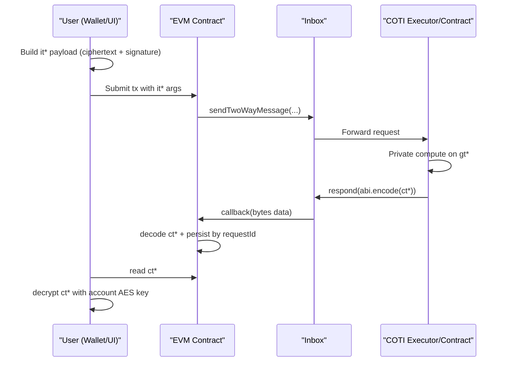

# Privacy Decentralized Apps on any EVM chain with COTI Privacy on Demand (PoD)

## What this means in practice

With PoD, a privacy dApp keeps public orchestration on EVM while private computation runs on COTI.

- User submits encrypted inputs (`it*`) from client.
- EVM contract sends request through Inbox.
- COTI side computes on private compute-domain values (`gt*`).
- EVM callback receives encrypted outputs (`ct*`).
- User decrypts `ct*` locally with account AES key.

## Important constraint behind “any EVM chain”

You can integrate from any EVM chain **only if** that chain has the required Inbox deployment and configured cross-chain route to the target COTI execution environment.

Without Inbox connectivity, requests cannot reach COTI and callbacks cannot return.

## Domain model

1. Client domain:
   Builds signed encrypted input payloads and decrypts result ciphertext.
2. EVM domain:
   Owns app state machine and async request lifecycle.
3. COTI domain:
   Executes private logic and returns encrypted response payloads.

## Why this architecture is used

- Sensitive data does not need to be stored in plaintext on EVM.
- EVM contracts still control business workflow and composability.
- Async request IDs provide traceability for private operations.

## What this SDK provides

- Inbox contracts/interfaces for request-response flow.
- `MpcLib` helpers for common private operations (`add`, `gt`).
- `MpcAbiCodec` argument typing and payload re-encoding logic.
- `MpcCore` type declarations and conversion operations.
- `CotiPodCrypto` TypeScript helper for encrypt/decrypt UX.

## What your team still must build

- App-specific EVM contracts.
- Optional COTI-side custom execution contracts for unsupported operations.
- Key onboarding and secure key storage UX.
- Indexing/monitoring for async request completion and failure handling.
